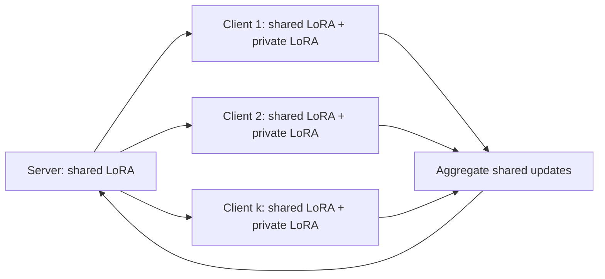

# 开题报告草案：资源异构场景下的个性化联邦 LoRA 微调方法研究

> 版本：v0.1  
> 日期：2026-05-25  
> 状态：导师讨论稿，不作为最终论文正文  
> 项目目录：`D:\paper`  
> 说明：本文档可直接用 Yank Note 打开和继续修改。当前引用已做第一轮页面核验，但多数文献尚未精读全文，后续进入论文正文前必须补充阅读笔记。

---

## 1. 拟定题目

**中文题目：** 面向资源异构客户端的个性化联邦 LoRA 微调方法研究

**英文题目：** Personalized Federated LoRA Fine-tuning under Resource-Heterogeneous Clients

**方法暂名：** `AdaFedLoRA-P`

含义：Adaptive Rank-aware Personalized Federated LoRA Fine-tuning。

---

## 2. 研究背景与问题引入

大语言模型在文本分类、自然语言推理、问答和教育文本理解等任务中表现出较强的迁移能力。然而，直接对大语言模型进行全参数微调需要较高的显存、计算和存储开销，并且在数据有限场景下容易出现过拟合、遗忘预训练知识以及部署成本过高等问题。近年来，参数高效微调（Parameter-Efficient Fine-Tuning, PEFT）成为大模型适配研究的重要方向。LoRA 通过低秩矩阵对预训练模型进行增量更新，在冻结主干参数的同时降低可训练参数规模[^lora]；QLoRA 进一步结合量化技术，降低了大模型微调的显存门槛[^qlora]。

与此同时，许多实际数据天然分布在不同机构、终端或用户侧。例如，不同学校、课程平台或学习系统中的学生文本数据通常无法直接集中，且不同客户端的数据规模、任务分布和计算资源差异明显。联邦学习通过在本地保留数据、上传模型更新的方式，为多方协同训练提供了基础框架。FedAvg 是联邦学习中的经典聚合方法[^fedavg]，但直接将传统联邦聚合迁移到大模型 LoRA 微调中，会遇到新的问题：一方面，客户端资源能力不同，统一 rank 的 LoRA 设置可能限制高资源客户端的表达能力，也会增加低资源客户端参与成本；另一方面，客户端数据 Non-IID 会导致统一全局适配器难以兼顾不同客户端的个性化需求。

近两年已有工作开始关注联邦大模型微调。FLoRA 指出，直接对 LoRA 适配器采用传统聚合可能产生聚合噪声，并提出支持异构 LoRA 的聚合方式[^flora]。FlexLoRA 进一步关注异构任务和异构资源，采用动态 LoRA rank 与 SVD 重分配机制缓解传统联邦学习中的“木桶效应”[^flexlora]。FSLoRA 通过 sketching 机制支持设备端协同 LoRA 微调[^fslora]。AFLoRA 则探索了资源感知的自适应联邦低秩微调[^aflora]。

这些研究说明，**联邦大模型微调已经从“能否把 LoRA 接入联邦学习”转向“如何在资源异构、数据异构和个性化需求下稳定高效地微调”**。然而，现有框架仍存在一个适合进一步研究的问题：多数方法更关注全局模型的聚合有效性或异构 rank 的系统适配，对“共享知识”和“客户端个性化知识”的显式解耦仍不充分；在资源异构场景下，rank 分配、个性化适配和通信成本之间也缺少一个便于复现实验验证的统一设计。

为此，本文拟研究一种面向资源异构客户端的个性化联邦 LoRA 微调方法，在冻结大模型主干的基础上，将 LoRA 适配器划分为全局共享部分和本地私有部分，并结合客户端资源预算进行自适应 rank 分配，从而在任务性能、个性化效果和通信成本之间取得更好的折中。

---

## 3. 国内外研究现状

### 3.1 参数高效微调

参数高效微调的核心思想是在尽量冻结预训练模型主体参数的情况下，仅训练少量新增参数或低维更新参数。LoRA 是当前应用最广泛的 PEFT 方法之一，其基本思想是在权重更新中引入低秩分解，从而减少训练参数量[^lora]。QLoRA 在 LoRA 基础上引入量化训练机制，使大模型在更低显存环境下完成微调成为可能[^qlora]。此外，PEFT 相关综述也表明，大模型微调正朝着低资源、低数据、低存储和可部署方向发展[^peftsurvey]。

从导师给出的 YOLO-Adapter 示例可以看到，适配器方法不仅是效率工具，也可以成为低数据场景下保持预训练主干泛化能力的重要机制。YOLO-Adapter 针对少样本目标检测，在冻结 YOLO 主干的情况下插入轻量卷积适配器，以缓解全参数微调中的过拟合和灾难性遗忘问题[^yoloadapter]。虽然该工作属于视觉检测方向，但其写作逻辑对本文有直接启发：先指出全量微调在低资源/低数据场景下的不足，再提出结构化适配器框架，并通过实验验证适配器比直接全量更新更适合受限场景。

### 3.2 联邦学习与联邦大模型微调

联邦学习通过多个客户端在本地训练、服务器聚合更新的方式实现协同建模。FedAvg 是经典基础方法，通过本地多步更新和服务器端加权平均减少通信轮数[^fedavg]。但在大语言模型场景中，全参数联邦微调几乎不可行，因此近年来的研究开始将 PEFT 与联邦学习结合。

FLoRA 关注联邦 LoRA 微调中的异构低秩适配器聚合问题，指出朴素 LoRA 聚合存在数学不准确性和聚合噪声风险，并提出支持异构 LoRA 的聚合方法[^flora]。FlexLoRA 进一步针对异构任务和异构客户端资源，提出动态调整本地 LoRA rank，并通过 SVD 进行权重重分配[^flexlora]。FSLoRA 利用 sketching 机制，使设备可以选择性更新全局 LoRA 模块的子矩阵，以适应设备端协同微调[^fslora]。AFLoRA 则从资源感知角度探索自适应联邦低秩微调[^aflora]。

现有研究已经证明，资源异构和 LoRA rank 异构是 FedLLM 中的重要问题。但这些工作也提示了新的研究空间：如果只维护一个全局 LoRA，即使 rank 可以动态变化，也可能难以适配强 Non-IID 客户端；如果完全个性化，又会削弱跨客户端共享收益。因此，有必要进一步探索共享 LoRA 与私有 LoRA 的解耦结构，并结合资源预算进行 rank 分配。

### 3.3 数据有限与教育文本场景

数据有限场景是参数高效微调的重要应用动机。GLUE 提供了多个自然语言理解任务，用于评估模型在不同 NLU 任务上的泛化能力[^glue]。MultiNLI 是具有多体裁覆盖的自然语言推理数据集，可用于验证模型对句间语义关系的理解能力[^mnli]。Stanford Sentiment Treebank 可用于情感分类任务[^sst]，AG News 可用于主题分类任务[^agnews]。

考虑到本文周期和可复现性，主实验拟采用通用英文文本分类和自然语言推理任务。教育方向不作为主实验，而作为补充实验。补充实验可优先考虑学生答案/教育文本分类类任务，例如 SemEval-2013 Task 7 涉及学生回答分析和文本蕴含挑战，可作为后续教育场景候选之一[^semeval2013]。具体数据集是否采用，需要进一步核验数据许可证、下载方式和任务划分。

---

## 4. 现有框架存在的问题

结合上述文献，本文初步认为现有联邦 LoRA 微调框架仍存在以下问题：

1. **统一全局适配器难以兼顾 Non-IID 客户端。**  
   客户端数据分布差异较大时，一个全局 LoRA 可能无法同时适配所有客户端。部分客户端可能从全局聚合中受益，另一部分客户端则可能出现性能下降。

2. **统一 rank 设置难以适应资源异构。**  
   如果所有客户端采用相同 LoRA rank，低资源客户端可能难以承担训练和通信成本；如果为了低资源客户端统一降低 rank，高资源客户端的表达能力又会被限制。

3. **异构 rank 聚合与个性化需求尚未充分结合。**  
   FLoRA、FlexLoRA 等工作已经关注异构 LoRA 聚合，但仍有空间进一步研究：如何将共享知识和私有知识显式拆分，并让 rank 分配同时服务于资源效率和个性化性能。

4. **性能、个性化和通信成本的联合评估仍需加强。**  
   只报告平均准确率不足以说明方法适合联邦场景。本文计划同时报告平均性能、客户端尾部性能、个性化收益和通信成本。

---

## 5. 拟解决的研究问题

本文拟围绕以下问题展开：

**RQ1：** 在资源异构和数据 Non-IID 同时存在时，统一 rank 的 FedLoRA 是否会导致性能与通信成本之间的折中不佳？

**RQ2：** 共享 LoRA 与私有 LoRA 的显式拆分，是否能够提升客户端个性化性能，尤其是尾部客户端性能？

**RQ3：** 基于客户端资源预算和训练收益的自适应 rank 分配，是否能够在不显著降低平均性能的情况下减少通信成本？

**RQ4：** 所提出方法在通用英文文本分类、NLI 以及教育文本补充任务上是否具有稳定性？

---

## 6. 拟提出方法

本文拟提出 `AdaFedLoRA-P`，即一种资源感知的个性化联邦 LoRA 微调方法。整体框架如下：

### 6.1 模型结构

设冻结的大语言模型主干参数为 $\theta_0$。客户端 $k$ 的 LoRA 更新由共享部分和私有部分组成：

$$
\Delta \theta_k = \Delta \theta_g + \Delta \theta_k^p
$$

其中，$\Delta \theta_g$ 表示服务器维护并聚合的全局共享 LoRA，$\Delta \theta_k^p$ 表示客户端本地私有 LoRA。客户端训练时使用：

$$
f_k(x) = f(x; \theta_0 + \Delta \theta_g + \Delta \theta_k^p)
$$

共享 LoRA 用于学习跨客户端共性知识，私有 LoRA 用于保留客户端本地数据分布特征。服务器只聚合共享 LoRA，私有 LoRA 不上传。

### 6.2 优化目标

本文拟采用如下优化目标：

$$
\min_{\Delta \theta_g, \{\Delta \theta_k^p\}_{k=1}^{K}}
\sum_{k=1}^{K} p_k \mathcal{L}_k(\theta_0 + \Delta \theta_g + \Delta \theta_k^p)
+ \lambda \sum_{k=1}^{K} \|\Delta \theta_k^p\|_F^2
+ \beta C(\{r_k\}_{k=1}^{K})
$$

其中：

- $K$ 为客户端数量；
- $p_k$ 为客户端权重，可按样本量或均匀分配；
- $\mathcal{L}_k$ 为客户端本地任务损失；
- $\lambda$ 控制私有 LoRA 的复杂度，避免过拟合；
- $r_k$ 为客户端 $k$ 的 LoRA rank；
- $C(\{r_k\})$ 表示通信成本或参数预算惩罚；
- $\beta$ 控制性能与通信成本之间的折中。

### 6.3 自适应 rank 分配

为适应不同客户端的资源能力，本文拟为每个客户端分配不同 rank：

$$
r_k = \mathrm{clip}
\left(
r_{\min} +
\left\lfloor
\alpha \cdot \hat{b}_k + \gamma \cdot \hat{g}_k
\right\rfloor,
r_{\min},
r_{\max}
\right)
$$

其中：

- $\hat{b}_k$ 表示归一化后的客户端资源预算；
- $\hat{g}_k$ 表示客户端近期训练收益，例如 loss 下降幅度；
- $r_{\min}$ 和 $r_{\max}$ 分别表示 rank 下限和上限；
- $\alpha$ 与 $\gamma$ 控制资源预算和训练收益的权重。

直观上，高资源且训练收益明显的客户端可以使用较高 rank；低资源或收益较低的客户端使用较低 rank，以降低通信和训练成本。

### 6.4 聚合策略

每轮训练中，服务器下发共享 LoRA。客户端在本地训练共享 LoRA 与私有 LoRA，但仅上传共享 LoRA 更新。服务器按样本量或统一权重聚合：

$$
\Delta \theta_g^{t+1}
=
\sum_{k \in \mathcal{S}_t}
\frac{n_k}{\sum_{j \in \mathcal{S}_t} n_j}
\Delta \theta_{g,k}^{t+1}
$$

其中，$\mathcal{S}_t$ 表示第 $t$ 轮参与训练的客户端集合，$n_k$ 表示客户端样本数量。

如果不同客户端共享 LoRA rank 不一致，初期版本将采用固定共享 rank + 异构私有 rank 的保守实现；若实验进展顺利，再扩展到异构共享 rank 的对齐聚合。

---

## 7. 创新点

本文计划突出以下创新点：

1. **提出资源异构下的个性化联邦 LoRA 微调框架。**  
   与只维护单一全局 LoRA 的方法不同，本文将 LoRA 拆分为共享部分和私有部分，以同时建模跨客户端共性知识和客户端个性化特征。

2. **设计资源感知的自适应 rank 分配机制。**  
   根据客户端资源预算和训练收益动态调整 LoRA rank，缓解统一 rank 对低资源客户端和高资源客户端都不友好的问题。

3. **建立性能、个性化和通信成本的联合评估方案。**  
   不仅比较平均任务性能，还评估客户端尾部性能、个性化收益和通信成本，从联邦学习实际部署角度验证方法有效性。

4. **在通用 NLP 主任务和教育文本补充任务上验证方法。**  
   主实验使用通用英文文本分类和 NLI 任务保证可复现性，补充实验使用学生答案/教育文本分类任务体现应用价值。

---

## 8. 实验设计

### 8.1 模型

开发阶段优先使用 1B 或更小模型：

- TinyLlama-1.1B 或同级别小模型；
- 若本地资源不足，降级为 0.5B 级模型；
- 后期可租用服务器补充更多客户端、更多随机种子或更大模型。

### 8.2 数据集

主实验候选：

| 类型 | 候选数据集 | 用途 | 状态 |
| --- | --- | --- | --- |
| 情感分类 | SST-2 / SST | 文本分类 | 已做页面级核验 |
| 主题分类 | AG News | 文本分类 | 已做页面级核验 |
| NLI | MNLI / GLUE-MNLI | 自然语言推理 | 已做页面级核验 |
| 多任务 NLU | GLUE 子集 | 稳定基准 | 已做页面级核验 |

补充实验候选：

| 类型 | 候选数据集 | 用途 | 状态 |
| --- | --- | --- | --- |
| 学生答案分类 | SemEval-2013 Task 7 / SciEntsBank 相关数据 | 教育文本补充实验 | 需进一步核验许可证和下载方式 |

### 8.3 联邦设置

初步设置：

- 客户端数量：10 或 20；
- 每轮参与比例：20% 到 50%；
- Non-IID 划分：Dirichlet 划分或按类别/任务划分；
- 资源异构：low / medium / high 三类客户端；
- rank 范围：例如 $r \in \{2, 4, 8, 16\}$，具体根据显存和模型确定。

### 8.4 对比方法

计划比较：

1. Local LoRA：每个客户端只训练本地 LoRA；
2. Centralized LoRA：集中式训练上界，若数据许可证允许模拟集中训练；
3. FedAvg-LoRA：统一 rank 的联邦 LoRA 基线；
4. Personalized LoRA：固定 rank 的共享 + 私有 LoRA；
5. FlexLoRA/FLoRA 相关思想复现或简化对比：根据代码可用性和实验周期决定；
6. AdaFedLoRA-P：本文方法。

### 8.5 评价指标

任务性能：

- Accuracy；
- Macro-F1；
- NLI accuracy。

个性化效果：

- 客户端平均性能；
- 最差 20% 客户端性能；
- 本地测试集性能提升。

系统成本：

- 每轮上传参数量；
- 总通信量；
- 训练时间；
- 显存占用。

稳定性：

- 至少 3 个随机种子；若算力不足，需在论文中明确说明限制。

---

## 9. 预期结果表达方式

本文不预设具体实验结果。若方法有效，预期应体现为：

1. 在相同通信预算下，AdaFedLoRA-P 的平均性能高于 FedAvg-LoRA；
2. 在相近平均性能下，AdaFedLoRA-P 的通信成本低于统一高 rank LoRA；
3. 共享 + 私有 LoRA 对尾部客户端或 Non-IID 客户端有更明显收益；
4. 自适应 rank 相比固定 rank 能更好适配 low / medium / high 资源客户端；
5. 教育文本补充实验能显示方法在学生答案/教育文本分类场景下具有应用潜力。

若实验不支持上述假设，将根据结果转向：

- 个性化 FedLoRA；
- 通信压缩 FedLoRA；
- 资源异构 FedLoRA 系统性评测。

---

## 10. 计划进度

| 周期 | 任务 | 产出 |
| --- | --- | --- |
| 第 1-2 周 | 精读 LoRA、QLoRA、FLoRA、FlexLoRA、FSLoRA、AFLoRA、FedAvg | 文献笔记与 related work 初稿 |
| 第 2-3 周 | 跑通单客户端 LoRA 和 FedAvg-LoRA | baseline 代码 |
| 第 4 周 | 实现 Non-IID 划分和资源异构模拟 | RQ1 初步实验 |
| 第 5-6 周 | 实现共享 + 私有 LoRA | 个性化消融 |
| 第 7 周 | 实现自适应 rank 分配 | rank 消融 |
| 第 8-9 周 | 主实验：文本分类 + NLI | 主结果表 |
| 第 10 周 | 教育文本补充实验 | 补充结果 |
| 第 11 周 | 论文初稿和图表整理 | 完整初稿 |
| 第 12 周 | 导师反馈、修改和投稿准备 | 投稿版本 |

---

## 11. 希望导师重点指导的问题

1. **选题边界是否合适？**  
   当前方案聚焦资源异构 + 个性化 FedLoRA，没有把隐私、多模态、复杂聚类都放入主线。请老师判断这个收缩是否适合 CCF C 期刊。

2. **创新点是否足够集中？**  
   目前创新点集中在共享/私有 LoRA 解耦、自适应 rank 分配和联合评估。请老师判断是否需要进一步加强理论分析或方法差异。

3. **与 FLoRA、FlexLoRA、AFLoRA 的差异是否清楚？**  
   这些工作与本文最接近。请老师指导本文应更强调个性化结构、资源分配策略，还是实验评测维度。

4. **实验任务选择是否合理？**  
   当前主实验选择通用英文文本分类 + NLI，教育学生答案分类作为补充。请老师判断是否符合论文定位。

5. **期刊目标是否匹配？**  
   当前目标是 CCF C 英文期刊。后续需要根据方法深度和实验完整性确定具体期刊。

---

## 12. 参考文献

[^lora]: Hu, E. J., Shen, Y., Wallis, P., Allen-Zhu, Z., Li, Y., Wang, S., Wang, L., & Chen, W. LoRA: Low-Rank Adaptation of Large Language Models. ICLR 2022. <https://openreview.net/forum?id=nZeVKeeFYf9>

[^qlora]: Dettmers, T., Pagnoni, A., Holtzman, A., & Zettlemoyer, L. QLoRA: Efficient Finetuning of Quantized LLMs. NeurIPS 2023. <https://openreview.net/forum?id=OUIFPHEgJU>

[^fedavg]: McMahan, H. B., Moore, E., Ramage, D., Hampson, S., & Aguera y Arcas, B. Communication-Efficient Learning of Deep Networks from Decentralized Data. AISTATS 2017. <https://research.google.com/pubs/pub44822.html>

[^flora]: Wang, Z., Shen, Z., He, Y., Sun, G., Wang, H., Lyu, L., & Li, A. FLoRA: Federated Fine-Tuning Large Language Models with Heterogeneous Low-Rank Adaptations. NeurIPS 2024. <https://papers.neurips.cc/paper_files/paper/2024/hash/28312c9491d60ed0c77f7fff4ad86dd1-Abstract-Conference.html>

[^flexlora]: Bai, J., Chen, D., Qian, B., Yao, L., & Li, Y. Federated Fine-tuning of Large Language Models under Heterogeneous Tasks and Client Resources. NeurIPS 2024. <https://papers.neurips.cc/paper_files/paper/2024/hash/1a134b50202088aa8c595cc99b310e5a-Abstract-Conference.html>

[^fslora]: Fang, W., Han, D.-J., Yuan, L., Hosseinalipour, S., & Brinton, C. G. Federated Sketching LoRA: A Flexible Framework for Heterogeneous Collaborative Fine-Tuning of LLMs. arXiv 2025. <https://arxiv.org/abs/2501.19389>

[^aflora]: Zhou, Y., Pang, X., & Wang, Z. AFLoRA: Adaptive Federated Fine-Tuning of Large Language Models with Resource-Aware Low-Rank Adaption. arXiv 2025. <https://arxiv.org/abs/2505.24773>

[^peftsurvey]: Ding, N., et al. Parameter-efficient fine-tuning of large-scale pre-trained language models. Nature Machine Intelligence, 2023. <https://www.nature.com/articles/s42256-023-00626-4>

[^glue]: Wang, A., Singh, A., Michael, J., Hill, F., Levy, O., & Bowman, S. GLUE: A Multi-Task Benchmark and Analysis Platform for Natural Language Understanding. ICLR 2019. <https://iclr.cc/virtual/2019/poster/845>

[^mnli]: Williams, A., Nangia, N., & Bowman, S. R. A Broad-Coverage Challenge Corpus for Sentence Understanding through Inference. NAACL 2018. <https://aclanthology.org/N18-1101>

[^sst]: Socher, R., Perelygin, A., Wu, J., Chuang, J., Manning, C. D., Ng, A., & Potts, C. Recursive Deep Models for Semantic Compositionality Over a Sentiment Treebank. EMNLP 2013. <https://nlp.stanford.edu/sentiment/index.html>

[^agnews]: Zhang, X., Zhao, J., & LeCun, Y. Character-level Convolutional Networks for Text Classification. NeurIPS 2015. <https://papers.nips.cc/paper/5782-character-level-convolutional-networks-for-text-classification>

[^semeval2013]: Dzikovska, M. O., et al. SemEval-2013 Task 7: The Joint Student Response Analysis and 8th Recognizing Textual Entailment Challenge. SemEval 2013. <https://dblp.org/db/conf/semeval/semeval2013>

[^yoloadapter]: Chiniforoushan, M., & Mohammadi, M. R. YOLO-adapter: Beyond full fine-tuning for accurate few-shot object detection. Neurocomputing, 2026. <https://doi.org/10.1016/j.neucom.2026.133138>
